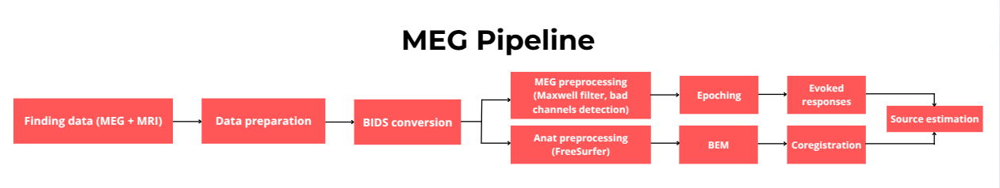

# MEG Pipeline: From Raw Data to Source Reconstruction

Welcome to the **MEG Pipeline**! This repository contains a comprehensive and modular pipeline for processing Magnetoencephalography (MEG) data, from raw data preparation to source reconstruction. The pipeline is designed to be easy to use, reproducible, and adaptable to various datasets.

---

## Table of Contents
1. [Overview](#overview)
2. [Pipeline Structure](#pipeline-structure)
3. [Getting Started](#getting-started)
   - [Prerequisites](#prerequisites)
   - [Installation](#installation)
   - [Running the Pipeline](#running-the-pipeline)
4. [Pipeline Steps](#pipeline-steps)
   - [01_finding-data](#01_finding-data)
   - [02_data-preparation](#02_data-preparation)
   - [03_bids-conversion](#03_bids-conversion)
   - [04_sanity-check](#04_sanity-check)
   - [05_meg-preprocessing](#05_meg-preprocessing)
   - [06_anat-preprocessing](#06_anat-preprocessing)
   - [07_source-reconstruction](#07_source-reconstruction)
5. [Outputs](#outputs)

---

## Overview 👀

This pipeline processes MEG data through a series of well-defined steps, ensuring high-quality results for source reconstruction. It includes:

- 📂 **Data preparation**: Cropping and organizing raw data.
- 💱 **BIDS conversion**: Converting data to the Brain Imaging Data Structure (BIDS) format.
- 🧹 **Preprocessing**: Filtering, noise covariance estimation, and artifact removal.
- 📊 **Anatomical preprocessing**: FreeSurfer reconstruction, BEM creation, and coregistration.
- 🧠 **Source reconstruction**: Estimating neural activity and generating reports.

The pipeline is implemented using a combination of Python scripts, shell scripts, and Jupyter notebooks, and can be run using a **Makefile** for automation.



---

## Pipeline Structure 🏗️

The pipeline is organized into the following directories:
```
.
├── 01_finding-data
├── 02_data-preparation
├── 03_bids-conversion
├── 04_sanity-check
├── 05_meg-preprocessing
├── 06_anat-preprocessing
├── 07_source-reconstruction
└── README.md
```

Each directory corresponds to a specific step in the pipeline. Below is a brief description of each step.

---

## Getting Started 📍

### Prerequisites

Before running the pipeline, ensure you have the following installed:

- **Python 3.8+**
- **MNE-Python** (for MEG processing)
- **FreeSurfer** (for anatomical preprocessing)
- **Jupyter Notebook** (for data exploration)
- **BIDS Validator** (for BIDS compliance checking)
- **Make** (for running the pipeline)

### Installation 

1. Clone this repository:
   ```bash
   git clone https://github.com/your-username/meg-pipeline.git
   cd meg-pipeline
   ```
2. Install Python dependencies:
   ```bash
   pip install -r requirements.txt
   ```
3. Set up FreeSurfer
    * Follow the FreeSurfer installation [guide](https://surfer.nmr.mgh.harvard.edu/fswiki/DownloadAndInstall).
    * Ensure the FreeSurfer environment is sourced in your shell:
        ```bash
        export FREESURFER_HOME=/path/to/freesurfer
        source $FREESURFER_HOME/SetUpFreeSurfer.sh
        ```

### Running the Pipeline
To run the entire pipeline, use the provided Makefile:
   ```bash
    make all
```

To run a specific step (e.g., MEG preprocessing):
   ```bash
    make meg-preprocessing
```
